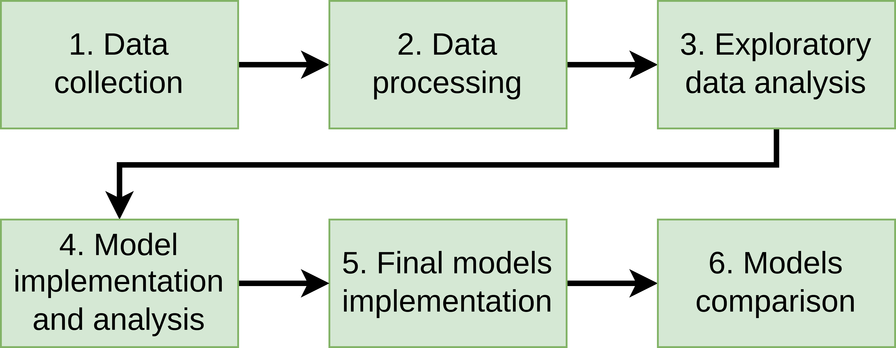

# Detection and Classification of Sexism on Social Media Using Multiple Languages, Transformers, and Ensemble Models




# Description
This repository contains the code for the paper **Detection and Classification of Sexism on Social Media Using Multiple Languages, Transformers, and Ensemble Models**. This paper was published at the SEPLN-WS-IberLEF 2022 <!-- [SEPLN-WS-IberLEF 2022](http://ceur-ws.org/Vol-2943/ -->
([the 4th Workshop on Iberian Languages Evaluation Forum](https://sites.google.com/view/iberlef2022) at [the SEPLN 2022 Conference](https://sepln2022.grupolys.org/)) scientific event. Descriptions of the implementation and the dataset are contained in the [paper](http://ceur-ws.org/Vol-3202/exist-paper2.pdf).

# Paper Abstract
Identifying and classifying sexist content in social media posts is a highly complex and relevant problem. Some characteristics such as sarcasm and multiple forms of sexism increase the difficulty of detecting and identifying this type of content. Nevertheless, it is essential to improve prediction quality to improve decision-making such as post removal, and user ban, among others. The main objective of this work is to propose a methodology and explore the use of different transformers architectures for two tasks in English and Spanish: sexism detection and sexism classification. Single-language and multilingual versions of the BERT, RoBERTa, Electra, and GPT2 architectures were evaluated on the EXIST 2022 shared task challenge at IberLEF 2022 dataset. It was observed that: (i) the use of the translation of the posts to English and then using single-language English and multilingual models present the best results; (ii) the best architectures were BERT and RoBERTa; (iii) using single-language Spanish models provided the worst results; (iv) sexism classification was more difficult than sexism detection; and (v) the use of ensembles were better than the GPT2 and Electra models, but worse than English single-language and multilingual models. An in-depth hyperparameters analysis was also conducted.


# Cite
If you find this [article](https://ceur-ws.org/Vol-3202/exist-paper2.pdf) or the [code](https://github.com/AngelFelipeMP/Transformers-Sexism-Classification) useful in your research, please cite us as: (link coming soon)


```
@proceedings{depaula2022exist,
  title={Detection and Classification of Sexism on Social Media Using Multiple Languages, Transformers, and Ensemble Models},
  author={de Paula, Angel Felipe Magnoss{\~a}o and da Silva, Roberto Fray},
  booktitle={Proceedings of the Iberian Languages Evaluation Forum (IberLEF 2022) co-located with the Conference of the Spanish Society for Natural Language Processing (SEPLN 2022)},
  address={La Coru{\~n}a, Spain}
  year={2021}
  }
```
<!-- 
```
@article{de2021sexism,
  title={Sexism Prediction in Spanish and English Tweets Using Monolingual and Multilingual BERT and Ensemble Models},
  author={de Paula, Angel Felipe Magnoss{\~a}o and da Silva, Roberto Fray and Schlicht, Ipek Baris},
  journal={arXiv preprint arXiv:2111.04551},
  year={2021}
```
} -->


# Credits
EXIST 2022 shared Task Organizers

EXIST 2022 proceedings: https://ceur-ws.org/Vol-3202

Task website: http://nlp.uned.es/exist2022/

Contact: jcalbornoz@lsi.uned
